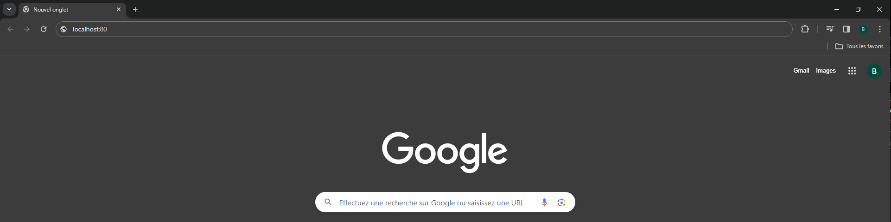
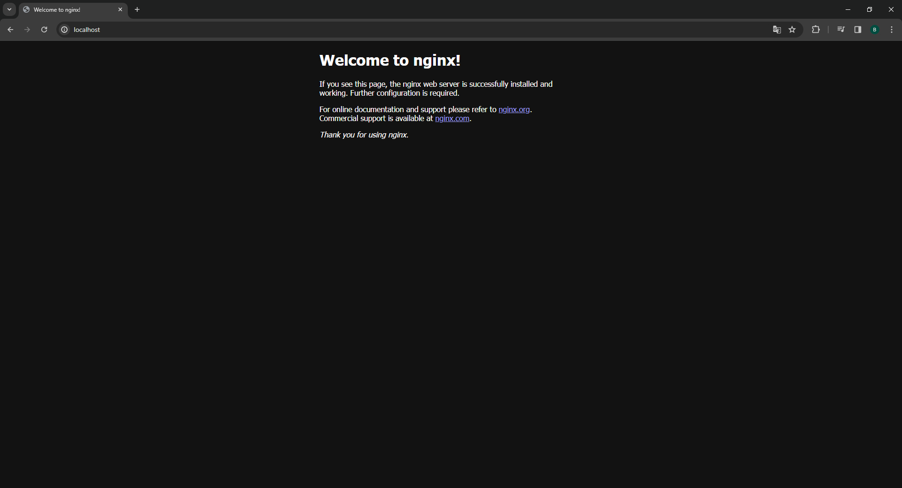

# 7. Vérifier que le conteneur fonctionne via votre navigateur (Informations sur la page de l'image DockerHub)

Pour vérifier que le conteneur tourne, il suffisait de regarder sur la page DockerHub :

Puis d'entrer l'URL dans votre navigateur :

Si le conteneur tourne bien, vous deviez voir cette page s'afficher :

