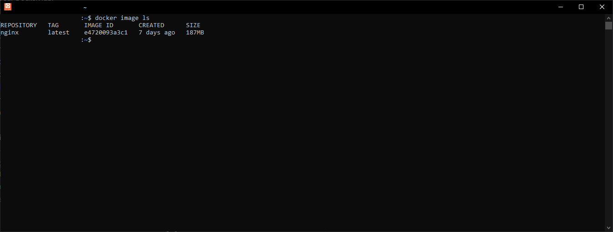
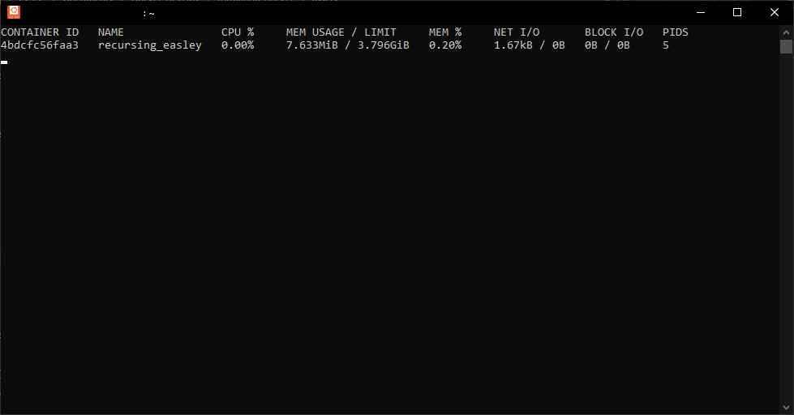
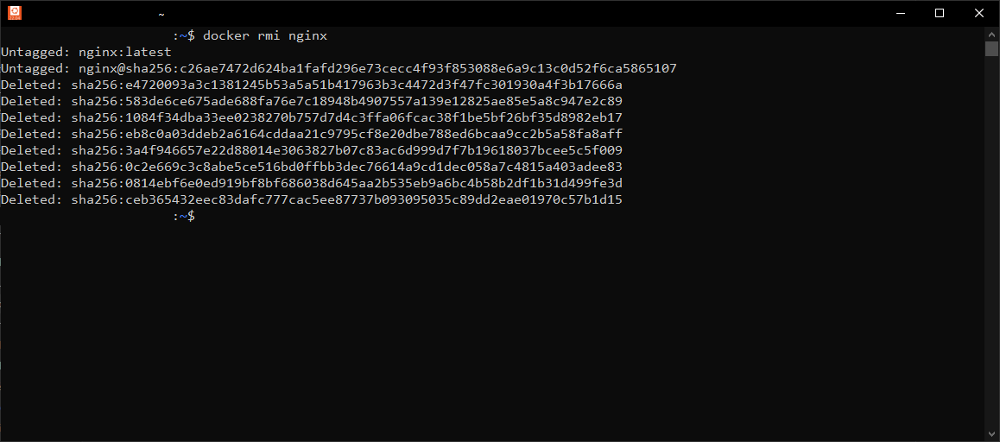

# 14. Supprimer l'image nginx proprement.

Si vous tentez de supprimer l'image `nginx` avec la commande `docker rmi nginx`, un message d'erreur s'affichera.

Pour régler l'erreur, il suffit d'éteindre le conteneur et le supprimer avec les commandes `docker stop [ID/NOM du conteneur]` et `docker rm [ID/NOM du conteneur]`  :

Et réexécuter la commande de suppression :

