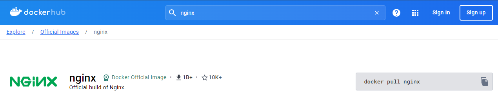

# 4. Lister tous les conteneurs de la machine.

Pour lister **tous** les conteneurs de la machine, il fallait exécuter la commande `docker ps -a` :

Ce qui a pour effet d'afficher les conteneurs (Ici, aucun conteneur ne tourne ou n'est arreté).