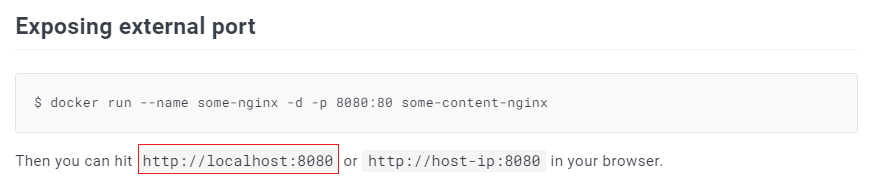

# 5. Démarrer un conteneur de l'image `nginx` en suivant les recommandations de l'image sur la page DockerHub.

Pour démarrer un conteneur de l'image `nginx`, il fallait lire la documentation présente sur la page DockerHub.

Ensuite, vous deviez taper la commande suivante dans le shell :

Détaillons la commande `docker run -d -p 80:80 nginx` :

1. `docker run` : Permet de dire à Docker de lancer un conteneur.
2. `-d` : Cette option permet de détacher le processus d'exécution du conteneur de celui du shell.
3. `-p` : Cette option permet d'exposer un port dans le conteneur.
4. `nginx` : Représente le nom de l'image.

La ligne en dessous représente l'ID du conteneur.