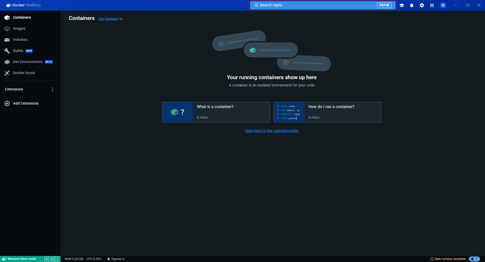

# 2. Chercher l'image nommée nginx.

Pour chercher l'image `nginx` sur Docker Desktop, il suffit de taper le nom de l'image dans la barre de recherche.

Puis de séléctionner l'image `nginx`.

Pour arriver sur la page de l'image.

