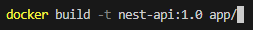

# 5. Consulter les informations détaillées du réseau ``production-network``.

En consultant de nouveau les informations détaillées du réseau, on se rends compte que la section `Containers` contient maintenant le conteneur `nginx`.

