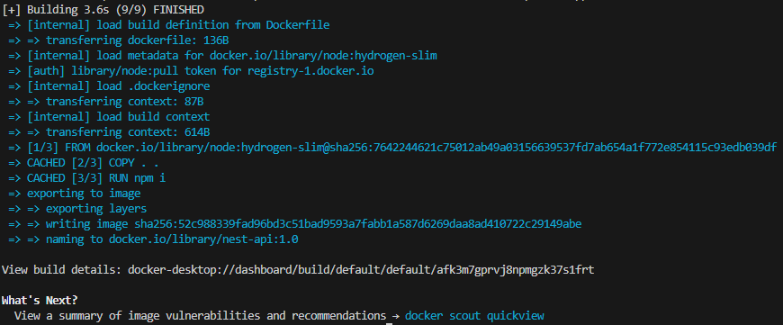

# 8. Supprimer le réseau `production-network`.

Pour supprimer un réseau Docker, il suffit d'exécuter la commande `docker network rm` suivi du nom ou de l'ID du réseau.

Cependant, sur cette image, on voit un message d'erreur car il semble que le réseau soit en cours d'utilisation.
Il faut alors éteindre et supprimer les conteneurs utilisants le réseau, afin de pouvoir supprimer ce dernier.

