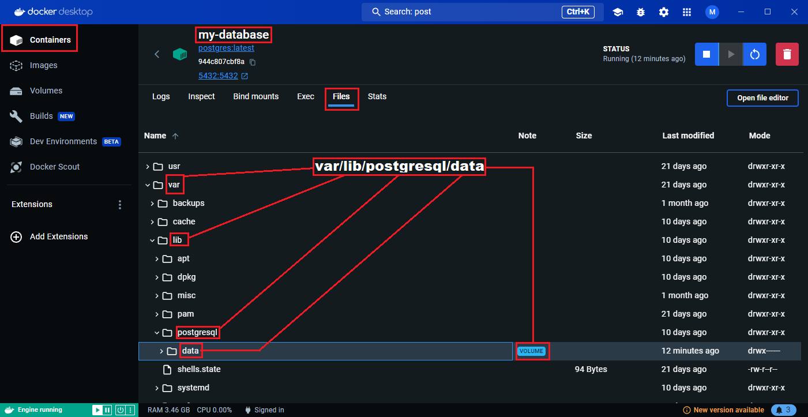
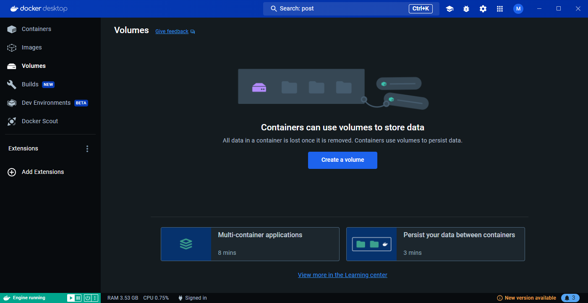

# 6. Démarrer un conteneur de l'image `nginx`.

Pour démarrer un conteneur de l'image `nginx`, il suffit de cliquer sur bouton de démarrage.

Et d'appuyer sur le bouton `run` sur la pop-up qui s'affiche.

