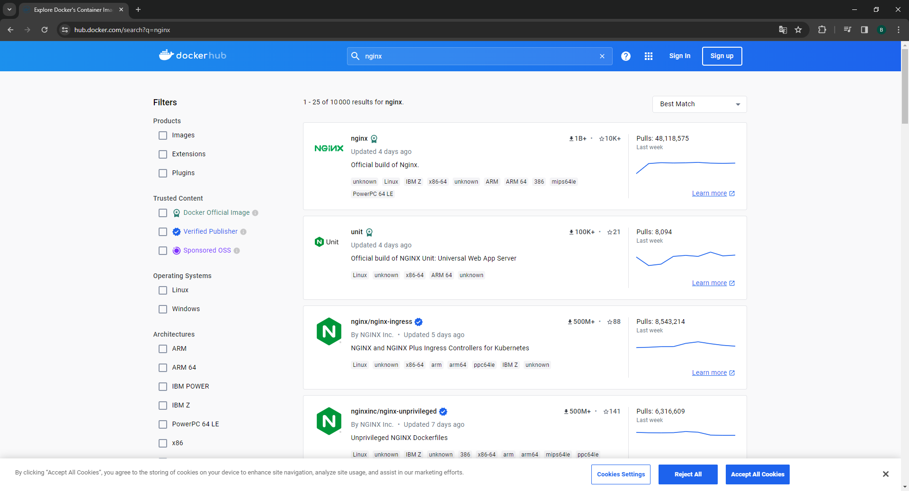
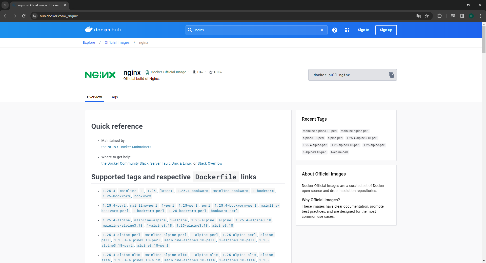

# 2. Chercher l'image nommée `nginx` sur DockerHub.

Pour trouver l'image `nginx` sur <a href='https://hub.docker.com/'>DockerHub</a>, il fallait utiliser la barre de recherche.

Et cliquer sur le premier résultat.

