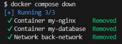

# 6. Démarrer un conteneur de l'image ``nest-api:1.0``.

Pour démarrer un conteneur de l'API, il suffit d'exécuter la commande `docker run`.

- `-p 3000:3000` : Définit qu'une redirection du port `3000` de l'hôte est effectué vers le port `3000` du conteneur. 