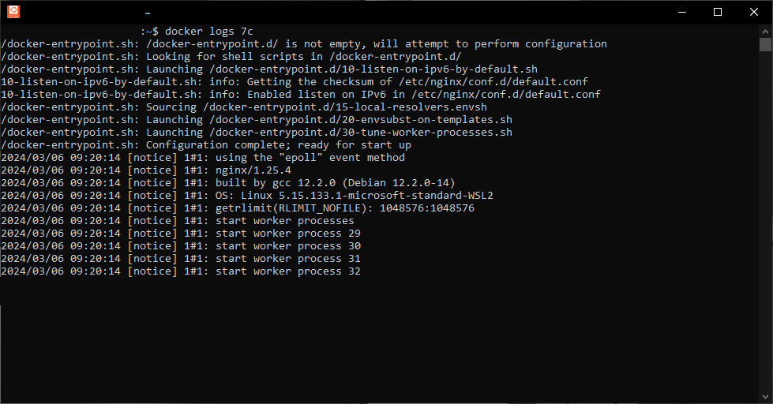

# 6. Vérifier que le conteneur tourne via Docker

Pour vérifier que le conteneur tourne, il suffit d'exécuter la commande `docker ps` :

Ce qui a pour effet d'afficher tous les conteneurs en cours d'exécution.