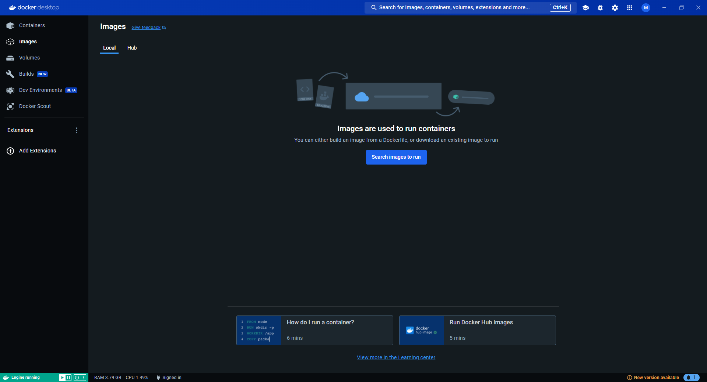

# 12. Supprimer l'image nginx proprement.

Pour supprimer l'image nginx **proprement**, il faut tout d'abord éteindre le conteneur.

Puis supprimer le conteneur.

Sans quoi, lors de la tentative de suppression de l'image, un message d'erreur apparaitra.

Une fois que le conteneur est arrété et supprimé, il est possible de supprimer l'image en cliquant sur la corbeille.

Plus aucune n'image n'est présente sur la machine.

